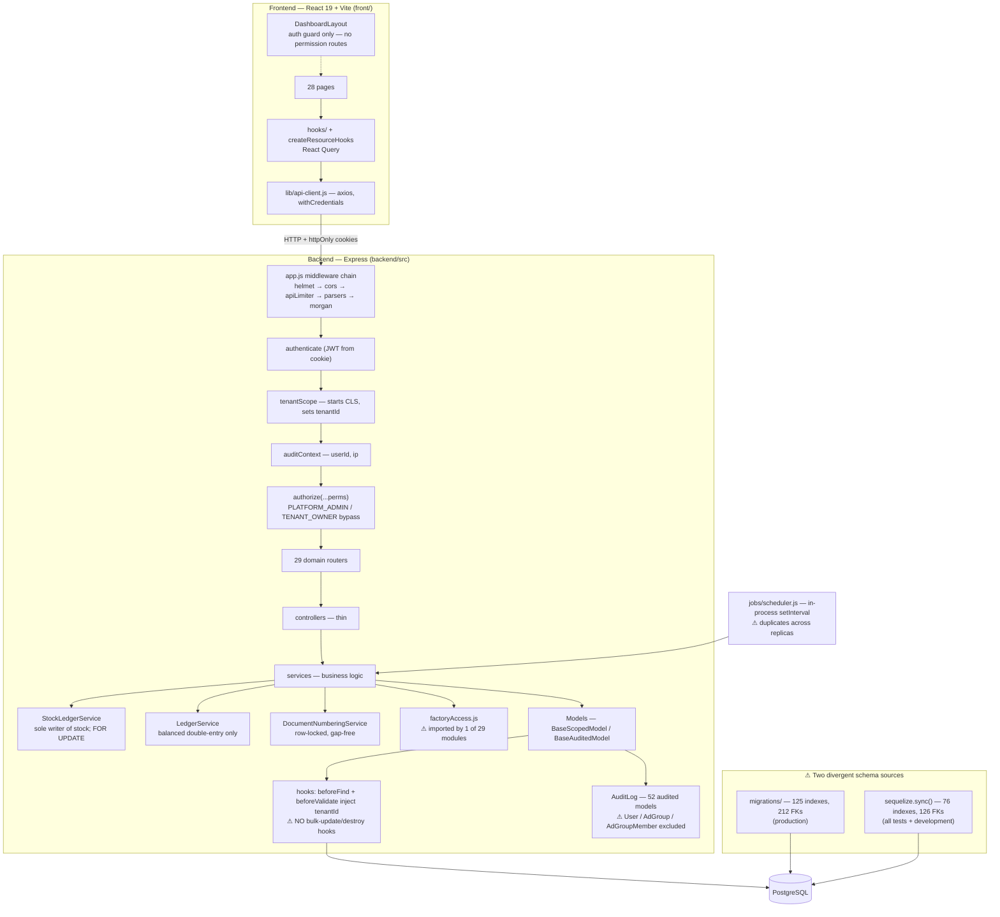

# Production Readiness & Architecture Audit — Manufacturing ERP

**Audit date:** 2026-08-11
**Scope:** `ERP/backend` (Node/Express/Sequelize/PostgreSQL) and `ERP/front` (React 19/Vite/React Query)
**Method:** static tracing plus live execution — the app was run against PostgreSQL, the existing 177-test suite was executed, a schema was built from migrations, and 30+ purpose-written probes were fired at the live API (authentication, RBAC, tenant isolation, factory isolation, concurrency, and a 46-step end-to-end business flow). No product code was modified.

---

# Executive Summary

## Overall status: **NOT PRODUCTION READY**

This is a genuinely substantial and, in large parts, well-engineered system. 242 backend source files implement 29 domain modules; the stock ledger is immutable-with-reversals and uses pessimistic row locking; money is handled in integer paise; journals are validated for balance before posting; the tenant-scoping hooks work; and a 46-step end-to-end business scenario (purchase → BOM → production → material consumption → finished goods → dispatch → invoice → part-payment → customer ledger → inter-plant transfer → expense → reports → cancellation) **completed 44 of 46 steps successfully** on a live server. The existing test suite passes 177/177.

It is nonetheless not ready to run a business, for seven independently blocking reasons — each verified by execution, not inference:

1. **The purchase chain never reaches the general ledger.** `createPurchaseInvoice` is a one-line `PurchaseInvoice.create(data)`. A ₹1,00,000 purchase invoice produced **0 journal entries** and left vendor outstanding at **0**. After paying that vendor in full, the vendor ledger read **+₹1,00,000 debit** — the books assert the vendor owes the company money. Accounts payable, purchase cost and the trial balance are all wrong.
2. **Privilege escalation.** A user holding only `EMPLOYEE_WRITE` created a `PLATFORM_ADMIN` account (HTTP 201) and promoted itself to `TENANT_OWNER` (HTTP 200). Both roles bypass every permission check in the system.
3. **Deactivated staff keep full access.** A `TERMINATED` employee logged in successfully (HTTP 200). A user deactivated mid-session minted a fresh access token from their refresh cookie (HTTP 200). `logout` clears cookies but revokes nothing, so a captured refresh token stays valid for 7 days.
4. **Factory/location isolation is effectively unimplemented.** `core/factoryAccess.js` is correct and complete — and is imported by exactly **one** of 29 modules. A user assigned only to Plant A read Plant B's stock (HTTP 200, balance 777) and booked a goods receipt into Plant B (HTTP 201).
5. **Cross-tenant data corruption.** `FinancialYear.update({isCurrent:false},{where:{isCurrent:true}})` runs with no tenant filter. Tenant A setting its current financial year **cleared tenant B's**, verified true→false. Because receipts, payments and invoices all require a current FY, this silently halts billing for every other tenant on the platform.
6. **Payment over-allocation race.** Two concurrent receipts each allocating the full value of one invoice both committed (HTTP 201/201); the invoice ended up allocated at **200% of its value**.
7. **The schema the tests and dev environment run on is not the schema production gets.** Migrations build 125 indexes and 212 foreign keys; `sequelize.sync()` — used by every test file and by `server.js` in development — builds 76 and 126. All 177 passing tests therefore run against a database missing 49 indexes, 86 FK constraints and the unique constraints that protect document numbering. Demonstrated materially: document-number allocation produced **13 duplicates in 20 concurrent requests** on the sync schema and **0 duplicates, gap-free** on the migration schema.

None of these are cosmetic, and none are visible from file structure alone — the files, models, routes and helpers for all of them exist and look right.

---

# Scorecard

| Area | Status | Severity | Evidence |
| --- | --- | --- | --- |
| Architecture | PASS | P2 | Clean router→controller→service→model layering across all 29 modules; no business logic found in controllers; `core/` platform layer (BaseModel, AuditedModel, AppError, tenantContext) is coherent. Deductions: `factoryAccess.js` written but unused; models and migrations have diverged. |
| Authentication | FAIL | P0 | Terminated user login → HTTP 200; refresh after deactivation → HTTP 200; refresh after logout → HTTP 200. No password reset or change-password endpoint exists anywhere. Token signature/expiry validation itself is correct (forged/garbage/missing/expired all → 401). |
| RBAC | FAIL | P0 | `EMPLOYEE_WRITE` → created `PLATFORM_ADMIN` (201) and self-promoted to `TENANT_OWNER` (200). Endpoint-level permission gates themselves work (4/4 unauthorized probes → 403). Role permissions accept arbitrary strings. |
| Organization (tenant) | FAIL | P0 | Reads are correctly isolated (cross-tenant GET → 404; list leakage none). Writes are not: an unscoped bulk `UPDATE` let tenant A clear tenant B's current financial year. |
| Location (factory) | FAIL | P0 | Cross-factory read (200, 777 units), cross-factory write (201), unfiltered list returns other plants' lots. `getAllowedFactoryIds` used in 1 of 29 modules. |
| Database | PARTIAL | P0 | Migration schema is well designed (37 unique indexes, FK `onDelete` policies, partial indexes handling NULL semantics correctly). But models declare almost no indexes (2 of 69 files), so `sync()` environments lose 49 indexes/86 FKs. |
| Inventory | PASS | P1 | Single `StockLedgerService` chokepoint enforced; `postEntry` refuses to run without a transaction; `SELECT … FOR UPDATE` verified — two concurrent 8-unit dispatches against 10 units → 201/400, final balance 2. Ledger-vs-balance reconciliation job exists. |
| Production | PASS | P2 | BOM versioning with `effectiveFrom`/SUPERSEDED, variance threshold + approval, wastage. E2E: 100 units produced consumed exactly 200 raw units per BOM and added 100 FG. |
| Sales | PASS | P2 | SO → confirm → reservation → ATP → production plan → dispatch verified end to end; credit-limit block with separate override permission works. |
| Purchase | FAIL | P0 | GRN correctly posts stock. Purchase invoice posts **nothing** to the ledger — 0 journal entries, vendor outstanding 0. |
| Payments | FAIL | P0 | Multi-mode receipts, partial payment and allocation caps work; concurrent allocation does not — invoice allocated to 200% of value. |
| Ledger | PARTIAL | P0 | Double-entry balance enforced pre-commit; reversal-not-edit discipline; cash-floor control. Undermined by the missing purchase leg — trial balance showed `CASH:-10000000 | AP:+10000000` after one purchase + payment. |
| Audit | PARTIAL | P1 | 52 models auto-audit CREATE/UPDATE with before/after snapshots, user, IP, timestamp. But `User`, `AdGroup`, `AdGroupMember` are **not** audited — role changes, permission changes and user creation leave no trail — and LOGIN/LOGOUT are never recorded. |
| Files | N/A → FAIL | P1 | There is no file upload, storage, download or archival capability anywhere in the codebase (no multer/busboy/S3, no `req.files`, no attachment columns). "Document Management" and `VIEW_PO_ATTACHMENTS` are unimplemented. |
| Notifications | PASS | P2 | Model, dedupe key, nightly alert generation and API verified (HTTP 200). Delivery is in-app only; no email/SMS channel. |
| Frontend | PARTIAL | P1 | Good structure: hooks layer, shared `createResourceHooks`, `data-table`, clean lint (0 errors), pages average 160 lines. But no route-level permission guards (15 of 28 pages ungated), no token refresh (forced logout every 15 min), zero tests. |
| Performance | PARTIAL | P1 | Pagination caps enforced (limit=100000 → 400). But ~60 unbounded `findAll` calls in services, N+1 `await`-in-loop patterns, and the missing indexes in sync-built environments. No load testing performed. |
| Testing | PARTIAL | P1 | 177 tests, 21 suites, all passing. Statements 77.7%, Lines 82.2%, **Branches 50.1%**, Functions 61.5%. But zero tests for tenant isolation, factory isolation, privilege escalation, disabled users, or concurrency — the exact areas where every P0 was found. |
| Deployment | FAIL | P1 | Only artefact is a `docker-compose.yml` that starts PostgreSQL. No Dockerfile for the app, no CI/CD, no reverse proxy/TLS config, no monitoring, no `trust proxy`, no DB pool or SSL settings, no rollback strategy. |
| Backup | NOT VERIFIED | P0 | No backup script, schedule, retention policy, or restore procedure exists in the repository. Nothing to test. |

---

# P0 Production Blockers

## P0-1 — Purchase invoices never post to the general ledger

**Problem.** The purchase → payable → payment chain is broken at the accounting layer. Goods receipts correctly post to the *stock* ledger, but the purchase invoice creates no journal entry, so accounts payable is never credited and purchase cost never recorded.

**Evidence (executed).**
```
Purchase invoice created: HTTP 201, amount=10000000 paise (₹1,00,000)
journal_entries referencing a purchase document: 0
vendor outstanding after invoice: 0 paise  (expected 10000000)

Vendor payment: HTTP 201
vendor ledger balance after paying the invoice in full: 10000000 paise
*** AP is now a DEBIT balance — the books claim the vendor owes us ₹100000 ***

Trial balance accounts: 1000:-10000000 | 2000:10000000
```

**File / function.** [src/api/purchasing/purchasing.service.js:219-221](src/api/purchasing/purchasing.service.js#L219-L221) — `PurchasingService.createPurchaseInvoice`. The module never imports `LedgerService` (confirmed: only `StockLedgerService` is imported, line 13). Compare with [src/api/invoicing/invoicing.service.js:181-201](src/api/invoicing/invoicing.service.js#L181-L201), where sales invoices post a full journal.

**Why it is dangerous.** Every financial output of the system is wrong for any business that buys anything: payables are understated by 100%, purchase expense and inventory valuation are absent, the trial balance does not balance in economic terms, GST input credit has no ledger basis, and paying a vendor drives their balance the wrong way — a clerk chasing "debtors" will see suppliers listed as owing money. This is not recoverable by reporting fixes; the source entries do not exist.

**Recommended fix.** In `createPurchaseInvoice`, wrap in a transaction and post a balanced journal mirroring the sales path: debit `PURCHASES`/`INVENTORY` (and `GST_INPUT_CGST`/`SGST`/`IGST` for the tax split), credit `ACCOUNTS_PAYABLE` with `partyId` set. Add `cancelPurchaseInvoice` posting a reversal via `LedgerService.reverseJournal`. Decide and document the GRN-vs-invoice recognition point (GR/IR clearing account is the standard approach if goods and invoice arrive separately).

**Verification method.** Repeat the probe above: after posting a purchase invoice, assert `journal_entries` contains a row referencing it, `GET /ledger/party/:vendorId` returns `-amountPaise` (credit), and after full payment returns `0`. Assert the trial balance sums to zero across accounts.

---

## P0-2 — Privilege escalation via the user endpoints

**Problem.** `role` is an ordinary, freely-writable field on user create/update. Nothing checks that the caller is authorised to grant the role being assigned, so any `EMPLOYEE_WRITE` holder (an HR or office administrator) can mint or become a platform administrator.

**Evidence (executed).**
```
R1 privilege-escalation-create: HR user (EMPLOYEE_WRITE only) created role=PLATFORM_ADMIN account
   -> HTTP 201, stored role=PLATFORM_ADMIN
R2 privilege-escalation-self:   PUT /users/{self} {role:TENANT_OWNER} -> HTTP 200;
   role in DB is now TENANT_OWNER (TENANT_OWNER bypasses every permission check)
```

**File / function.** [src/api/users/user.schema.js:12](src/api/users/user.schema.js#L12) and [:29](src/api/users/user.schema.js#L29) (`role: z.nativeEnum(SystemRoles)` on both create and update); [src/api/users/user.service.js:78](src/api/users/user.service.js#L78) (`user.update(data)` applies it verbatim); [src/api/users/user.router.js:18-19](src/api/users/user.router.js#L18-L19) (gated only by `EMPLOYEE_WRITE`). The bypass that makes it fatal is [src/middlewares/authorize.js:5](src/middlewares/authorize.js#L5) — `BYPASS_ROLES` skip all permission checks.

**Why it is dangerous.** It collapses the entire RBAC model to a single permission. Any compromised or malicious HR account becomes a full platform administrator across the tenant — able to read all financial data, alter the ledger, and (given P0-5) affect other tenants. It is also self-service: the user promotes themselves, no second party required.

**Recommended fix.** Remove `role` from `updateUserSchema` entirely and expose role changes through a dedicated, separately-permissioned endpoint (e.g. `USER_ROLE_ASSIGN`). Enforce a privilege lattice server-side: a caller may only assign roles strictly below their own; `PLATFORM_ADMIN` must never be assignable through the tenant API. Forbid self-role-modification unconditionally. Apply the same rule to `POST /roles/:id/members`.

**Verification method.** Re-run probes R1/R2 — both must return 403, and the DB role must be unchanged. Add a regression test asserting a self-promotion attempt fails.

---

## P0-3 — Deactivated users retain access; sessions cannot be revoked

**Problem.** Three related gaps: `login` never checks `user.status`; `refresh` never checks it either; and `logout` only clears cookies — there is no refresh-token store, denylist, or `tokenVersion`, so nothing can be revoked.

**Evidence (executed).**
```
A1 disabled-user-login:        POST /auth/login as TERMINATED employee -> HTTP 200 (full access token issued)
A2 refresh-after-deactivation: Deactivated user replayed 7-day refresh cookie -> HTTP 200 (new 15m access token minted)
A3 refresh-after-logout:       Replayed refresh cookie AFTER /auth/logout -> HTTP 200
A4 token-validation:           forged=401 garbage=401 missing=401 expired=401  (correct)
```

**File / function.** [src/api/auth/auth.service.js:53-75](src/api/auth/auth.service.js#L53-L75) (`login` — no status check), [:77-96](src/api/auth/auth.service.js#L77-L96) (`refresh` — no status check, no rotation, no store), [src/api/auth/auth.controller.js:57-61](src/api/auth/auth.controller.js#L57-L61) (`logout` — `clearCookie` only).

**Why it is dangerous.** Terminating an employee does not terminate their access. A departing storekeeper or accountant keeps working credentials indefinitely: they can log in fresh, and even without logging in, any refresh token captured earlier renews access for 7 days. For a system holding financial records this defeats the primary offboarding control and there is no incident response lever — you cannot force-logout a compromised account.

**Recommended fix.** Reject login and refresh when `status !== ACTIVE`. Persist refresh tokens (or a per-user `tokenVersion` claim) and invalidate on logout, password change, deactivation, and role change; rotate the refresh token on every use and detect reuse. Additionally implement password reset and change-password flows — neither exists (`grep` for `reset-password|forgot|changePassword` returns nothing).

**Verification method.** Re-run A1–A3; all three must return 401. Add a test that deactivating a user invalidates their existing session within one request.

---

## P0-4 — Factory / location isolation is not enforced

**Problem.** `core/factoryAccess.js` implements the correct BR-29 controls (`getAllowedFactoryIds`, `applyFactoryFilter`, `assertFactoryAccess`). It is imported by **one** file — `dashboard.controller.js`. Every other module takes `factoryId` from the request and trusts it.

**Evidence (executed).**
```
F1 cross-factory-read:  GET /inventory/lots?factoryId=<Plant B> as a user assigned only to Plant A
                        -> HTTP 200, 1 lot returned; balance endpoint -> HTTP 200, balance=777
F2 cross-factory-write: POST /purchasing/receipts {factoryId: Plant B} as Plant-A-only user -> HTTP 201
F4 unscoped-list:       GET /inventory/lots (no factoryId) -> returns Plant B lots to a Plant-A-only user
H7 reports:             POST /reports/run {factoryId: Plant B} as Plant-A-only user -> HTTP 200
```
Enforcement census: 25 of 26 services that accept `factoryId` contain no access check.

**File / function.** [src/core/factoryAccess.js](src/core/factoryAccess.js) (unused); representative unchecked entry points: [src/api/inventory/inventory.router.js](src/api/inventory/inventory.router.js), [src/api/purchasing/purchasing.service.js:122](src/api/purchasing/purchasing.service.js#L122) (`createGoodsReceipt`), [src/api/reports/reports.service.js:60-64](src/api/reports/reports.service.js#L60-L64) (`run`), plus sales, production, dispatch, transfer, expenses, payments, ledger, GSTR, analytics.

**Why it is dangerous.** In a multi-plant manufacturer this is the control that stops one plant's staff seeing and altering another's stock, costs and margins. Its absence means any authenticated user with a module permission can read every plant's data and post transactions — including goods receipts and stock movements — into plants they have no relationship with. Because assignment records exist (`user_factories`), the system appears to enforce this while doing nothing.

**Recommended fix.** Make factory scoping structural rather than per-call: add a middleware that resolves `getAllowedFactoryIds(req)` once and attaches it to the request, then a shared service-layer guard that every `factoryId`-bearing read filters through (`applyFactoryFilter`) and every write asserts (`assertFactoryAccess`). Reject requests that omit `factoryId` on factory-scoped endpoints rather than returning all factories.

**Verification method.** Re-run F1/F2/F4/H7 — reads must exclude Plant B, writes must 403. Add a shared test helper that, for every factory-scoped route, asserts a foreign `factoryId` yields 403.

---

## P0-5 — Cross-tenant write via unscoped bulk UPDATE

**Problem.** `BaseScopedModel` injects the tenant filter in `beforeFind` and `beforeValidate` only. It deliberately declares no `beforeBulkUpdate`/`beforeBulkDestroy` hooks, so any `Model.update(values, { where })` executes **without a tenant predicate**. `setCurrentFinancialYear` does exactly that against a `where` clause that matches every tenant's rows.

**Evidence (executed).**
```
T3 cross-tenant-write-bulk-update: Tenant A set-current-FY (HTTP 200);
   tenant B FY.isCurrent true -> false
   — FinancialYear.update ran with no tenant filter and cleared ANOTHER TENANT's current year
```

**File / function.** [src/api/factory/factory.service.js:61](src/api/factory/factory.service.js#L61) — `FinancialYear.update({ isCurrent: false }, { where: { isCurrent: true }, transaction })`; root cause in [src/core/BaseModel.js:56-83](src/core/BaseModel.js#L56-L83).

**Why it is dangerous.** A routine, low-privilege administrative action in one tenant silently breaks every other tenant on the platform. Because `getCurrentFinancialYearId` throws when no current FY exists, the downstream effect is that **receipts, payments, invoices, goods receipts and every other document-numbered transaction stop working** for all other tenants, with an error message ("No current financial year is configured") that points the victim at their own settings. The same class of defect exists wherever bulk updates run: [src/api/inventory/reservation.service.js:119](src/api/inventory/reservation.service.js#L119) and [:129](src/api/inventory/reservation.service.js#L129), [src/api/inventory/stockLedger.service.js:23](src/api/inventory/stockLedger.service.js#L23), [src/api/parties/partyAddress.service.js:70](src/api/parties/partyAddress.service.js#L70).

**Recommended fix.** Two layers. (a) Fix the immediate call sites by adding `tenantId: getTenantId()` to each bulk `where`. (b) Close the class of bug: add `beforeBulkUpdate`/`beforeBulkDestroy` hooks to `BaseScopedModel` that inject the tenant into `options.where` — noting the correct signature is `(options)` for bulk hooks (the file's own comment documents the crash caused by getting this wrong, which is a reason to write it carefully, not to omit it). Belt-and-braces: PostgreSQL row-level security keyed on a session tenant GUC.

**Verification method.** Re-run T3 — tenant B's `isCurrent` must remain `true`. Add a generic test that, for each bulk-update call site, a second tenant's rows are untouched.

---

## P0-6 — Payment allocation race allows an invoice to be paid twice

**Problem.** `createReceipt` validates allocation headroom with an unlocked aggregate read (`getInvoiceAllocatedAmount`) and never locks the invoice row, so two concurrent receipts both observe zero prior allocation and both commit.

**Evidence (executed).**
```
C2 payment-over-allocation: invoice total=590000 paise;
   two concurrent full-value receipts -> HTTP 201/201;
   total allocated in DB=1180000 (OVER-ALLOCATED by 590000 paise — invoice paid twice)
```
For contrast, the same probe confirmed stock deduction is *not* racy (C1: 201/400, correct) and party edits are protected by optimistic locking (C3: 200/409).

**File / function.** [src/api/payments/payments.service.js:96-140](src/api/payments/payments.service.js#L96-L140) — `PaymentsService.createReceipt`; helper `getInvoiceAllocatedAmount` at [:35-49](src/api/payments/payments.service.js#L35-L49).

**Why it is dangerous.** Two clerks posting the same customer payment — a routine occurrence at month end — silently over-settle the invoice. The customer ledger under-reports what is owed, the receivables report is wrong, and the error is invisible because both receipts look valid. The same pattern applies to vendor payments.

**Recommended fix.** Lock the invoice row inside the transaction before computing headroom: `SalesInvoice.findByPk(id, { transaction, lock: transaction.LOCK.UPDATE })` and re-read the allocated total under that lock. Add a database-level backstop — a `CHECK`-enforced `allocatedAmountPaise` column on the invoice maintained in the same transaction, or a constraint trigger asserting `SUM(allocations) <= totalPaise`.

**Verification method.** Re-run C2 — exactly one receipt must succeed (the other 409/400) and DB allocation must equal the invoice total.

---

## P0-7 — Model definitions and migrations have diverged; tests validate the wrong schema

**Problem.** Indexes, unique constraints and foreign keys are declared in migrations but not in the Sequelize models (only 2 of 69 model files declare `indexes:`). Every test file calls `sequelize.sync({ force: true })`, and `server.js` calls `sequelize.sync({ alter: true })` in development — both build the schema from models.

**Evidence (executed).** Two databases built side by side:

| | migration-built | sync-built (tests + dev) |
| --- | --- | --- |
| tables | 71 | 70 |
| indexes | **125** | **76** |
| foreign keys | **212** | **126** |

Behavioural proof, same code, same concurrency:
```
sync-built schema:      20 concurrent doc-number allocations -> 7 unique, 13 DUPLICATES, 3 series rows created
migration-built schema: 20 concurrent doc-number allocations -> 20 unique, 0 duplicates, gap-free, 1 series row
document_series indexes (sync):      document_series_pkey
document_series indexes (migration): + document_series_unique_with_factory, _without_factory
```

**File / function.** [src/api/documentSeries/documentSeries.model.js](src/api/documentSeries/documentSeries.model.js) (no `indexes`) vs [src/migrations/20260811000000-phase1-milestone-a.js:66-75](src/migrations/20260811000000-phase1-milestone-a.js#L66-L75) (two partial unique indexes, correctly reasoned about NULL semantics); [src/server.js:16-19](src/server.js#L16-L19) (`sync({ alter: true })`).

**Why it is dangerous.** It invalidates the safety signal from the test suite. All 177 tests pass against a database that cannot enforce referential integrity (86 missing FKs) or uniqueness (missing document-number constraints) — so an entire category of data-integrity regression is untestable, and a defect that *would* be caught in production (duplicate invoice numbers, a statutory violation under Indian GST rules) passes CI silently. Any environment stood up with `sync` — every developer machine — behaves differently from production. `sync({ alter: true })` against a real database is itself hazardous: it will attempt destructive column alterations to reconcile drift.

**Recommended fix.** Make migrations the single source of truth for schema *and* make tests use them: replace `sync({ force: true })` in test setup with `db:migrate` against a truncated test database. Remove `sync({ alter: true })` from `server.js` (development should migrate too). Backfill `indexes:` into the models only if you intend `sync` to remain usable; otherwise delete the sync path entirely. Add a CI check that diffs a migration-built schema against a model-built one.

**Verification method.** Rebuild both schemas and assert index/FK parity, then re-run the full suite against the migration-built database and confirm it still passes.

---

## P0-8 — No backup or recovery capability — **NOT VERIFIED**

**Problem.** No backup script, cron entry, retention policy, snapshot configuration, or documented restore procedure exists anywhere in the repository (`grep -rliE "pg_dump|pg_restore|backup"` over `src/`, `package.json` and YAML returns nothing). The only infrastructure file is a `docker-compose.yml` that starts a PostgreSQL container with a local volume.

**Why it is dangerous.** An ERP is the system of record for statutory financial data. Without a tested restore, any hardware failure, bad migration or accidental deletion is unbounded data loss, with legal consequences for GST records.

**Recommended fix.** Automated `pg_dump` (or managed-service PITR) on a schedule, encrypted off-host storage, explicit retention (e.g. 30 daily / 12 monthly), and a **restore rehearsal** into a scratch database with a documented RTO/RPO. Because there is no file storage in the system, backup scope is currently database-only.

**Verification method.** Perform and document a full restore into a clean environment and reconcile row counts and trial balance against the source. Marked **NOT VERIFIED** — nothing exists to test.

---

# P1 Issues

## P1-1 — Role and permission changes are not audited; no LOGIN/LOGOUT trail

**Problem / Evidence.** 52 models extend `BaseAuditedModel` and record CREATE/UPDATE with before/after snapshots, user, IP and timestamp — genuinely good. But `User`, `AdGroup` and `AdGroupMember` extend plain `BaseScopedModel`, and authentication events are never recorded. E2E steps 40–41 failed: audit contained 44 entries with actions `CREATE,UPDATE` and **no** login/logout events and no `User`/`AdGroup` entity types.
**File.** [src/api/users/user.model.js:9](src/api/users/user.model.js#L9), [src/api/roles/role.model.js:9](src/api/roles/role.model.js#L9), [src/api/roles/adGroupMember.model.js:11](src/api/roles/adGroupMember.model.js#L11), [src/api/auth/auth.service.js](src/api/auth/auth.service.js).
**Why it matters.** Phase 14 explicitly requires LOGIN, LOGOUT, ROLE CHANGE and PERMISSION CHANGE. These are the events an investigator needs after a breach — and precisely the ones P0-2 exploits. The escalation in R1/R2 left no trace.
**Fix.** Migrate the three identity models to `BaseAuditedModel` (they are excluded "as out of scope"; they are the highest-value targets). Emit explicit `LOGIN`, `LOGIN_FAILED` and `LOGOUT` audit rows from `auth.service`. Ensure `AuditLog` writes are append-only at the DB grant level.
**Verification.** Re-run E2E steps 40–41; both must pass.

## P1-2 — Frontend never refreshes tokens: users are logged out every 15 minutes

**Problem / Evidence.** Access tokens expire in 15 minutes. `grep -rn "refresh" front/src/` returns **nothing** — the client never calls `POST /auth/refresh`. The axios interceptor redirects to `/login` on any 401.
**File.** [../front/src/lib/api-client.js:12-24](../front/src/lib/api-client.js#L12-L24), [../front/src/hooks/use-auth.js](../front/src/hooks/use-auth.js).
**Why it matters.** Every user is ejected mid-task every 15 minutes, losing unsaved form state — unusable for data-entry staff working through invoices. The 7-day refresh cookie exists purely as attack surface (see P0-3) while delivering no benefit.
**Fix.** Add a response interceptor that, on 401, calls `/auth/refresh` once, retries the original request, and only redirects if the refresh fails — with a single-flight guard so concurrent 401s trigger one refresh.

## P1-3 — No route-level permission enforcement in the frontend

**Problem / Evidence.** `DashboardLayout` correctly guards authentication, and the sidebar filters items by permission. But no route checks permissions: 15 of 28 pages contain no `hasPermission` reference at all, including `RolesPage`, `MigrationPage`, `AuditLogPage`, `SettingsPage`, `FactoriesPage`.
**File.** [../front/src/App.jsx:36-69](../front/src/App.jsx#L36-L69), [../front/src/layouts/DashboardLayout.jsx](../front/src/layouts/DashboardLayout.jsx).
**Why it matters.** This is a UX/robustness issue, not a security hole — the API does enforce permissions (verified: 4/4 unauthorized probes returned 403). A user typing `/migration` gets a rendered page that then fails with error toasts instead of a clean "not authorised".
**Fix.** A `<RequirePermission permission="...">` wrapper around each route element, driven by the same `NAVIGATION` permission metadata already defined.

## P1-4 — `trust proxy` not configured: rate limiting collapses and audit IPs are wrong

**Problem / Evidence.** `app.get('trust proxy') = false` (verified). Behind any load balancer or reverse proxy, `req.ip` is the proxy's address.
**File.** [src/app.js](src/app.js) (no `app.set('trust proxy', …)`), [src/middlewares/rateLimiter.js](src/middlewares/rateLimiter.js), [src/middlewares/auditContext.js:14](src/middlewares/auditContext.js#L14).
**Why it matters.** Two consequences: the per-IP limiter becomes one shared global bucket — 100 requests per 15 minutes for *all users combined*, a self-inflicted denial of service — and every audit row records the proxy IP, destroying the forensic value of `ipAddress`. Conversely, enabling it naively lets clients spoof `X-Forwarded-For`; it must be set to the specific trusted hop count.
**Fix.** `app.set('trust proxy', 1)` (or the exact number of trusted proxies). Raise `apiLimiter.max` to a realistic figure for an ERP session and key it by user id where authenticated. Exempt `/health`.

## P1-5 — Deployment, CI and operational readiness are absent

**Problem / Evidence.** The only infrastructure artefact is `docker-compose.yml` (PostgreSQL only). No Dockerfile, no `.github/`, no CI config, no TLS/reverse-proxy config, no process manager, no monitoring or alerting, no rollback plan. `npm run lint` fails outright — ESLint 9 is installed with no `eslint.config.js`. No DB pool sizing or SSL in [src/config/database.js](src/config/database.js) (defaults to max 5 connections, unencrypted).
**Why it matters.** There is no repeatable path from this repository to a running production system, and no automated gate preventing a regression from shipping. Default pool of 5 will bottleneck under concurrent load; unencrypted DB connections are unacceptable for financial data over any non-local network.
**Fix.** Multi-stage Dockerfile; CI running migrations + tests + lint on every PR; TLS termination and `NODE_ENV=production`; explicit `pool` and `dialectOptions.ssl`; centralised log shipping; health/readiness split (`/health` liveness plus a readiness probe that checks DB connectivity); documented rollback via migration `down` scripts.

## P1-6 — Seed script creates a `PLATFORM_ADMIN` with password `12345678`

**Problem / Evidence.** [src/scripts/seed.js:159-160](src/scripts/seed.js#L159-L160) — `passwordHash: await bcrypt.hash('12345678', 10)` with `role: PLATFORM_ADMIN` for the first employee.
**Why it matters.** If the seed is ever run against a production or staging database — common when bootstrapping — the system ships with a known-credential superuser. `12345678` also violates the system's own configured `passwordMinLength` policy semantics.
**Fix.** Require an env-supplied password, or generate a random one and print it once; refuse to run when `NODE_ENV=production`.

## P1-7 — In-process scheduler duplicates nightly work across replicas

**Problem / Evidence.** [src/jobs/scheduler.js](src/jobs/scheduler.js) uses `setInterval` inside the API process. The file's own comment acknowledges it "dies with the process and does not coordinate across replicas".
**Why it matters.** Any horizontally-scaled deployment runs the nightly batch N times concurrently — lot promotion, ageing classification, reservation expiry and alert generation all racing. The jobs are documented as idempotent, which limits but does not eliminate the damage (duplicate notifications, contention). A single-replica deployment misses the run entirely on restart.
**Fix.** Move to an external scheduler (cron/Kubernetes CronJob) invoking a CLI entry point, or add an advisory-lock guard (`pg_advisory_lock`) so only one replica executes.

## P1-8 — Report parameters are unvalidated; missing params cause HTTP 500

**Problem / Evidence.** `POST /reports/run` with `params` omitting `factoryId` → HTTP 500, logged as `WHERE parameter "factoryId" has invalid "undefined" value`. `RUNNERS` dispatch passes `params || {}` straight through with no per-report schema.
**File.** [src/api/reports/reports.service.js:16-32](src/api/reports/reports.service.js#L16-L32), [:60-64](src/api/reports/reports.service.js#L60-L64).
**Why it matters.** Every report type is crashable by a well-formed request, and saved reports persist unvalidated `params` that fail only at run time.
**Fix.** A per-`reportType` zod schema validated in `create`, `run` and `runSaved`.

---

# P2 Improvements

| # | Issue | Evidence / File | Fix |
| --- | --- | --- | --- |
| P2-1 | Non-UUID `:id` path params return HTTP 500 instead of 400/404 | Verified 5/5: `reports/not-a-uuid=500 users/abc=500 roles/xyz=500 parties/123=500 factories/oops=500` | Shared `validate(z.object({id: z.string().uuid()}), 'params')` on all `:id` routes |
| P2-2 | Frontend ships one 823 kB JS bundle (211 kB gzip), no code splitting | `vite build` output | Route-level `React.lazy` + `manualChunks` for vendor |
| P2-3 | Branch coverage 50.1%, function coverage 61.5% | `jest --coverage` | Target ≥70% branch on services handling money and stock |
| P2-4 | Zero frontend tests | No `*.test.*` under `front/src` | Vitest + Testing Library for permission gating, forms, money conversion |
| P2-5 | Duplicate `search` key in role list schema silently drops the trimmed variant | [src/api/roles/role.schema.js:26,29](src/api/roles/role.schema.js#L26) | Remove the duplicate; enable ESLint `no-dupe-keys` |
| P2-6 | `npm run lint` fails (ESLint 9, no flat config) | Executed | Add `eslint.config.js` and wire into CI |
| P2-7 | ~60 unbounded `findAll` calls in services; `await`-in-loop N+1 patterns | `migration.service.js` (12), `analytics.service.js` (8), `gstr.service.js` (5), `reservation.service.js` (6) | Add hard caps / cursoring; batch with `IN` queries |
| P2-8 | `rebuildStockBalances` runs `StockLot.update(..., { hooks: false })`, bypassing tenant scoping | [src/api/inventory/stockLedger.service.js:318](src/api/inventory/stockLedger.service.js#L318) | Add explicit `tenantId` to the `where` |
| P2-9 | `/health` returns static JSON; no DB readiness check | [src/app.js:69-71](src/app.js#L69-L71) | Split liveness/readiness; readiness pings `sequelize.authenticate()` |
| P2-10 | Notifications are in-app only | [src/api/notifications](src/api/notifications) | Add email/SMS channel if business requires it |
| P2-11 | Document numbers are gap-free under a row lock — a serialization bottleneck at high volume | [src/api/documentSeries/documentNumbering.service.js](src/api/documentSeries/documentNumbering.service.js) | Acceptable and statutorily correct; monitor lock wait times |

---

# Security Findings

| ID | Finding | Status | Severity |
| --- | --- | --- | --- |
| S1 | Privilege escalation to `PLATFORM_ADMIN`/`TENANT_OWNER` via user create/update | **FAIL** — verified | P0 |
| S2 | Deactivated users can log in; refresh tokens survive deactivation and logout; no revocation | **FAIL** — verified | P0 |
| S3 | Factory-level authorization not enforced (read and write) | **FAIL** — verified | P0 |
| S4 | Cross-tenant write via unscoped bulk UPDATE | **FAIL** — verified | P0 |
| S5 | No password reset / change-password capability | **FAIL** — absent | P1 |
| S6 | Role permissions accept arbitrary strings, not validated against `WebPermissions` | **FAIL** — `POST /roles` with `['NOT_A_REAL_PERMISSION','DROP TABLE','*']` → HTTP 201 | P1 |
| S7 | `trust proxy` unset → rate limiter degenerates to a global bucket; audit IPs are the proxy's | **FAIL** — verified | P1 |
| S8 | Permissions embedded in a 15-minute JWT; revoking a role takes up to 15 min to take effect | **PARTIAL** — by design, but with no revocation path (S2) the window is unbounded | P1 |
| S9 | Token validation (signature, expiry, absence, tampering) | **PASS** — 4/4 → 401 | — |
| S10 | Endpoint permission gates | **PASS** — 4/4 unauthorized → 403 | — |
| S11 | Cross-tenant reads (direct id and list) | **PASS** — 404 / no leakage | — |
| S12 | SQL injection via `search` and `sortBy` | **PASS** — parameterised; table intact after `'; DROP TABLE parties;--` | — |
| S13 | Error responses leak no stack traces | **PASS** — 500 body is `{"success":false,"message":"Internal Server Error"}`; stacks go to the logger only | — |
| S14 | Security headers | **PASS** — helmet supplies `x-content-type-options`, `x-frame-options`, `strict-transport-security`, `content-security-policy` | — |
| S15 | Cookies `httpOnly`, `sameSite=strict`, `secure` in production | **PASS** | — |
| S16 | Password hashing | **PASS** — bcrypt, cost 10 | — |
| S17 | Secrets hygiene | **PASS** — `.env` gitignored, only `.env.example` tracked; env validated by zod at boot | — |
| S18 | File upload attack surface | **N/A** — no upload capability exists | — |

---

# Architecture Findings

**Strengths.** Layering is consistent and correctly directed: `router → controller → service → model`, with `core/` as a dependency-free platform layer. Controllers were checked for business and database logic and are thin — the pattern holds across all 29 modules. There is a single response envelope (`sendSuccess`/`sendList`/`sendError`), a single error taxonomy (`AppError` subclasses mapped to status codes centrally), and one chokepoint per critical concern: `StockLedgerService` for stock, `LedgerService` for journals, `DocumentNumberingService` for numbering. The frontend mirrors this with an `apiClient` → hooks → pages layering; only one page (`SettingsPage`) reaches for `apiClient` directly. `createResourceHooks` removes the five-hooks-per-resource duplication. No circular dependencies were observed; deferred `require()` calls inside functions are used deliberately to break cycles (e.g. `AuditedModel` requiring `AuditLog`).

**Weaknesses.**

1. **A correct security module that nobody calls.** `factoryAccess.js` is the clearest architectural failure: the abstraction was designed, documented against BR-29, and then not wired into the service layer. Cross-cutting authorization implemented as an *optional helper* will always drift; it needs to be structural (middleware + a base query builder that cannot be bypassed).
2. **Tenant isolation depends on a hook that only covers two of four write paths.** `beforeFind` and `beforeValidate` are covered; bulk update and bulk destroy are not, and the omission is documented as intentional. The reasoning given (every call site fetches first) is empirically false — 10 bulk call sites exist, one of which corrupts other tenants. Security invariants should not rest on a convention that the code itself violates.
3. **Schema authority is split.** Models and migrations both describe the schema and disagree. There must be exactly one source of truth.
4. **Comments assert properties the code does not have.** Several comments state guarantees ("gap-free… so concurrent users never receive duplicates", "every call site fetches the instance via a tenant-scoped findByPk") that were disproved by execution. These read as design intent recorded as fact, and they actively mislead reviewers.
5. **Audit coverage decided per model rather than per policy.** The `BaseAuditedModel`/`BaseScopedModel` split left the identity models — the highest-value audit targets — untracked, described as "out of scope".

## Architecture diagram (as verified)



---

# Database Findings

**Strengths.** The migration set is the best-engineered part of the schema work: 71 tables, 212 FK constraints with deliberate `onDelete` policies (`CASCADE` for tenant-owned rows, `RESTRICT` on `journal_lines.accountId`, `SET NULL` on `audit_logs.userId` so audit survives user deletion), and 37 unique indexes covering every document-number series (`sales_invoices`, `receipts`, `payments`, `credit_notes`, …) — exactly right for statutory numbering. The `document_series` pair of *partial* unique indexes correctly handles PostgreSQL's "every NULL is distinct" behaviour for nullable `factoryId`, with the reasoning recorded in the migration. Money is stored as integer paise throughout, avoiding float drift. Optimistic locking (`lockVersion`) is applied selectively to human-edited records, with a documented rationale for not applying it blanket — and it demonstrably works (409 on concurrent edit).

**Findings.**

| ID | Finding | Severity |
| --- | --- | --- |
| D1 | Models declare almost no indexes (2/69 files); `sync`-built schemas lose 49 indexes and 86 FKs — see P0-7 | P0 |
| D2 | Bulk `UPDATE`/`DELETE` bypass tenant scoping entirely — see P0-5 | P0 |
| D3 | No unique constraint enforcing one allocation total ≤ invoice total; over-allocation is prevented only in application code, and racily — see P0-6 | P0 |
| D4 | `sequelize.sync({ alter: true })` runs in development and will attempt destructive column alterations to reconcile drift | P1 |
| D5 | No connection-pool sizing or SSL in `config/database.js`; defaults to 5 connections, unencrypted | P1 |
| D6 | `User.email` is globally unique rather than per-tenant — documented as deliberate (login has no tenant selector), but it means two tenants can never share a user's email address, a real limitation for shared accountants/consultants | P2 |
| D7 | Soft delete is not used anywhere; `destroy()` is a hard delete (e.g. `factory.destroy()`, `mixDesign.destroy()`), so deleting a master record is unrecoverable and breaks historical documents unless an FK `RESTRICT` catches it | P1 |
| D8 | `audit_logs` has no append-only enforcement at the database grant level — an application-level compromise can rewrite history | P1 |

**Missing indexes / risky queries.** In sync-built environments effectively everything is unindexed beyond primary keys. In the migration schema, the frequently-filtered paths are covered (`stock_lots(tenantId,factoryId,productId,status)`). Queries worth watching: `getInvoiceAllocatedAmount` aggregates `payment_allocations` joined to both `receipts` and `payments` with no supporting composite index; `getPartyOutstanding` sums all `journal_lines` for a party with only `partyId` filtering — both grow linearly with transaction history and will degrade on a busy tenant.

---

# Performance Findings

| ID | Finding | Evidence | Severity |
| --- | --- | --- | --- |
| PF1 | Missing indexes in every non-migration environment | 76 vs 125 indexes | P0 (rolled into P0-7) |
| PF2 | Global rate limit of 100 requests / 15 min, applied app-wide before routing and keyed on a proxy IP | [src/middlewares/rateLimiter.js:3-9](src/middlewares/rateLimiter.js#L3-L9) + `trust proxy=false` | P1 |
| PF3 | ~60 `findAll` calls without limits in services; `migration.service.js` (12), `analytics.service.js` (8), `gstr.service.js` (5) load entire tables into memory | grep census | P1 |
| PF4 | 48 `await`-inside-`for` sites — sequential round-trips (N+1), e.g. `postJournal` resolves accounts one at a time, `rebuildStockBalances` updates lots one at a time | grep census | P1 |
| PF5 | Default connection pool of 5 | [src/config/database.js](src/config/database.js) | P1 |
| PF6 | Frontend ships a single 823 kB bundle | `vite build` | P2 |
| PF7 | `promoteEligibleLots` issues a bulk UPDATE at the top of every stock read/consume path | [src/api/inventory/stockLedger.service.js:22-33](src/api/inventory/stockLedger.service.js#L22-L33) | P2 |
| PF8 | Pagination caps enforced (`limit=100000` → 400) — good | verified | — |

No load or soak testing was performed; throughput and latency under realistic concurrency are **NOT VERIFIED**.

---

# Test Coverage Gaps

**Measured (backend):** 21 suites, 177 tests, all passing. Statements 77.69% · Lines 82.17% · **Branches 50.07%** · Functions 61.54%.
**Frontend:** no test framework and no tests.

Critical functionality with **no** test coverage — note that every P0 in this report lives in this list:

| Required area | Status |
| --- | --- |
| Authentication — disabled/terminated users | **MISSING** (defect found) |
| Authentication — token revocation / logout semantics | **MISSING** (defect found) |
| Authentication — password reset / change | **N/A** (feature absent) |
| RBAC — privilege escalation / role assignment authority | **MISSING** (defect found) |
| RBAC — permission catalogue validation | **MISSING** (defect found) |
| Organization isolation — cross-tenant **writes** | **MISSING** (defect found) |
| Organization isolation — cross-tenant reads | MISSING (behaviour is correct, but untested) |
| Location/factory isolation — reads and writes | **MISSING** (defect found) |
| Inventory — concurrency / oversell | MISSING (behaviour is correct, but untested) |
| Payments — concurrent allocation | **MISSING** (defect found) |
| Ledger — purchase-side journal posting | **MISSING** (defect found) |
| Document numbering — concurrency | **MISSING**, and the sync schema would make such a test fail for the wrong reason |
| Audit — login/logout, role and permission changes | **MISSING** (defect found) |
| Cancellation | Partial — sales invoice cancellation covered; purchase-side untested |
| BOM / production / sales / purchase happy paths | **COVERED** (`sales-production.test.js`, `purchasing-cheques-migration.test.js`, `invoicing.test.js`, `returns.test.js`, `workforce.test.js`) |

The pattern is consistent: the suite thoroughly tests *business happy paths* and validation rules, and does not test *security boundaries or concurrency* at all.

---

# End-to-End Test Results

Executed against a live server and PostgreSQL (`tests` DB, sync-built schema). **44 of 46 automated assertions passed** (steps 40 and 41 failed outright). A 45th — step 33, vendor ledger — passed its HTTP assertion but returned a semantically wrong figure, and is marked accordingly below.

| # | Step | Result | Detail |
| --- | --- | --- | --- |
| 01 | Login as admin | PASS | HTTP 200 |
| 02 | Read organizations | PASS | HTTP 200 |
| 03 | Create location/factory A | PASS | HTTP 201 |
| 04 | Create location/factory B | PASS | HTTP 201 |
| 05 | Create financial year | PASS | HTTP 201 |
| 06 | Set current financial year | PASS | HTTP 200 (**but corrupts other tenants — P0-5**) |
| 07 | Create role + assign permissions | PASS | HTTP 201 |
| 08 | Create user | PASS | HTTP 201 |
| 09 | Assign user to role | PASS | HTTP 201 |
| 10 | Create customer | PASS | HTTP 201 |
| 11 | Create vendor | PASS | HTTP 201 |
| 12 | Create UOM | PASS | HTTP 201 |
| 13 | Create HSN code | PASS | HTTP 201 |
| 14 | Create raw material | PASS | HTTP 201 |
| 15 | Create finished good | PASS | HTTP 201 |
| 16 | Create BOM / mix design | PASS | HTTP 201 |
| 17 | Activate BOM version | PASS | HTTP 200, status=ACTIVE |
| 18 | Purchase → stock IN (opening) | PASS | HTTP 201 |
| 19 | Verify raw-material stock | PASS | balance=500 (expected 500) |
| 20 | Create sales order | PASS | HTTP 201 |
| 21 | Confirm SO (stock check + reservation) | PASS | HTTP 200 |
| 22 | Available-to-promise check | PASS | HTTP 200 |
| 23 | Generate production requirement | PASS | HTTP 201, 1 line |
| 24 | Confirm production plan | PASS | HTTP 200 |
| 25 | Create + complete production | PASS | HTTP 201 |
| 26 | Raw material consumed per BOM | PASS | 500 → 300 (100 units × 2) |
| 27 | Finished goods into stock | PASS | balance=100 |
| 28 | Create delivery challan (stock OUT) | PASS | HTTP 201 |
| 29 | Create sales invoice | PASS | HTTP 201, total 23,600,000 paise |
| 30 | Partial payment, 2 payment modes | PASS | HTTP 201 (CASH + UPI) |
| 31 | Customer ledger outstanding | PASS | 11,800,000 paise = exactly half |
| 32 | Create purchase invoice | PASS (API) | HTTP 201 — **but posts no journal, P0-1** |
| 33 | Vendor ledger | **FAIL (semantic)** | outstanding=0 after a ₹1,00,000 purchase invoice |
| 34 | Initiate stock transfer A→B | PASS | HTTP 201 |
| 35 | Receive stock transfer at B | PASS | HTTP 200 |
| 36 | Both locations reflect transfer | PASS | A=250, B=50 |
| 37 | Create expense | PASS | HTTP 201 |
| 38 | Cash flow / cash book | PASS | HTTP 200, 2 entries |
| 39 | Audit logs populated | PASS | 44 rows, actions CREATE/UPDATE |
| 40 | LOGIN/LOGOUT audited | **FAIL** | no authentication events recorded anywhere |
| 41 | Role/permission changes audited | **FAIL** | `User`/`AdGroup`/`AdGroupMember` are not audited models |
| 42 | Notifications | PASS | HTTP 200 |
| 43 | Dashboard | PASS | HTTP 200 — operational, trends, scope, financial |
| 44 | Reports | PASS | HTTP 200 |
| 45 | GSTR-1 statutory report | PASS | HTTP 200 |
| 46 | Cancel invoice (reversing journal) | PASS | HTTP 200 |

### Security & concurrency probe results

| Probe | Result |
| --- | --- |
| A1 terminated-user login | **BUG** — HTTP 200 |
| A2 refresh after deactivation | **BUG** — HTTP 200 |
| A3 refresh after logout | **BUG** — HTTP 200 |
| A4 forged / garbage / missing / expired tokens | OK — 401/401/401/401 |
| R1 `EMPLOYEE_WRITE` creates `PLATFORM_ADMIN` | **BUG** — HTTP 201 |
| R2 self-promotion to `TENANT_OWNER` | **BUG** — HTTP 200 |
| R3 unauthorized endpoints (ledger, inventory, audit, reports) | OK — 403 ×4 |
| R4 junk permission strings accepted | **BUG** — HTTP 201 |
| T1 cross-tenant read by id | OK — 404 |
| T2 cross-tenant list leakage | OK — none |
| T3 cross-tenant bulk write | **BUG** — tenant B `isCurrent` true → false |
| F1 cross-factory read | **BUG** — HTTP 200, balance 777 |
| F2 cross-factory write | **BUG** — HTTP 201 |
| F4 unfiltered list spans factories | **BUG** |
| C1 concurrent dispatch oversell | OK — 201/400, balance 2 |
| C2 concurrent payment allocation | **BUG** — 200% allocated |
| C3 concurrent same-record update | OK — 200/409 (optimistic lock) |
| D1 doc numbering, sync schema | **BUG** — 13 duplicates / 20 |
| D1′ doc numbering, migration schema | OK — 20 unique, gap-free |
| H1 non-UUID `:id` params | **BUG** — 500 ×5 |
| H2 stack-trace leakage | OK |
| H3 security headers | OK — 4/4 present |
| H5 `trust proxy` | **BUG** — false |
| H6 pagination cap | OK — 400 |
| H8 SQL injection (search + sortBy) | OK — parameterised |

---

# Final Production Gate

**Rule applied:** the application must not be declared production-ready while any P0 remains unresolved.

**Open P0s: 8** — P0-1 (purchase ledger), P0-2 (privilege escalation), P0-3 (deactivated users / no revocation), P0-4 (factory isolation), P0-5 (cross-tenant write), P0-6 (payment over-allocation), P0-7 (schema divergence), P0-8 (backup — NOT VERIFIED).

## Verdict: **NOT PRODUCTION READY**

To state it plainly, and without discounting the P0s because most features work: the system can run a complete manufacturing business cycle correctly in a single-tenant, single-factory, single-user setting. It cannot yet be trusted with (a) more than one tenant, (b) more than one factory, (c) more than one concurrent user posting payments, (d) staff who ever leave, or (e) purchases appearing in the accounts. Those are not edge cases for an ERP; they are the operating conditions.

The engineering quality here is high enough that these are all tractable — most are tens of lines in the right place rather than redesigns. The deeper issue to address alongside them is process: a 177-test suite passing at 82% line coverage gave no warning about any of the eight blockers, because it tests business happy paths against a schema production will never use.

---

# Remediation Plan

## Stage 0 — Restore the safety net (do this first; 1–2 days)

Nothing below can be verified until the test environment resembles production.

1. **Point tests at migrations.** Replace `sequelize.sync({ force: true })` in all 21 test files with a truncate-and-migrate helper; remove `sync({ alter: true })` from `server.js`. *(P0-7)*
2. **Add CI** running migrations, the full suite, and lint on every push; add `eslint.config.js` so lint runs at all. *(P1-5, P2-6)*
3. **Add a schema-parity check** to CI comparing a migration-built schema to a model-built one, failing on divergence. *(P0-7)*

## Stage 1 — P0 blockers (1–2 weeks)

Ordered by blast radius, with the cheapest high-impact fixes first.

4. **Purchase → ledger posting.** Implement journal posting in `createPurchaseInvoice` plus a cancellation reversal; decide the GRN/invoice recognition point. Reconcile any existing data. *(P0-1)*
5. **Close privilege escalation.** Remove `role` from user create/update; add a separately-permissioned role-assignment endpoint with a privilege lattice and a self-modification ban. *(P0-2)*
6. **Fix session lifecycle.** Status checks in `login` and `refresh`; persisted refresh tokens or `tokenVersion` with revocation on logout/deactivation/role change; refresh-token rotation. *(P0-3)*
7. **Tenant-safe bulk writes.** Add `beforeBulkUpdate`/`beforeBulkDestroy` to `BaseScopedModel` (correct `(options)` signature) *and* fix the 10 call sites explicitly. *(P0-5)*
8. **Lock payment allocation.** `FOR UPDATE` on the invoice plus a DB-level backstop constraint. *(P0-6)*
9. **Enforce factory access.** Middleware resolving allowed factories + a mandatory service-layer guard across all 25 unprotected services; reject omitted `factoryId` on factory-scoped endpoints. This is the largest piece of work — budget for it. *(P0-4)*
10. **Backup and restore.** Automated encrypted backups, retention, and a **rehearsed** restore with documented RTO/RPO. *(P0-8)*

**Gate:** re-run every probe in this report; all `BUG-CONFIRMED` entries must flip. Add each as a permanent regression test — these are the tests the suite most needs.

## Stage 2 — P1 (2–3 weeks)

11. Audit the identity models + explicit LOGIN/LOGOUT/LOGIN_FAILED events. *(P1-1)*
12. Frontend token refresh with single-flight retry. *(P1-2)*
13. Password reset and change-password flows. *(S5)*
14. `trust proxy`, realistic rate limits, user-keyed limiting, `/health` exemption. *(P1-4)*
15. Deployment: Dockerfile, TLS, `pool`/`ssl` config, readiness probe, log shipping, rollback runbook. *(P1-5, D5, P2-9)*
16. Move the nightly scheduler out of process or add an advisory lock. *(P1-7)*
17. Validate role permissions against `WebPermissions`; per-report param schemas. *(S6, P1-8)*
18. Frontend route-level permission guards. *(P1-3)*
19. Seed script: no default admin password; refuse to run in production. *(P1-6)*
20. Soft-delete or restrict-delete policy for master data. *(D7)*
21. Append-only enforcement on `audit_logs` at the DB grant level. *(D8)*

## Stage 3 — P2 (ongoing)

22. UUID validation on all `:id` routes. *(P2-1)*
23. Raise branch coverage toward 70% on money- and stock-handling services; introduce frontend tests. *(P2-3, P2-4)*
24. Bound the unbounded `findAll` calls; batch the N+1 loops; add composite indexes for `payment_allocations` and `journal_lines(partyId)`. *(P2-7, PF4)*
25. Frontend code splitting. *(P2-2)*
26. Load and soak testing to establish real throughput limits — currently NOT VERIFIED. *(PF-all)*
27. Housekeeping: duplicate `search` key, `hooks:false` tenant bypass in `rebuildStockBalances`. *(P2-5, P2-8)*

---

## Audit method and reproducibility

Verification artefacts were written outside the repository (`scratchpad/`): `audit-verify.test.js` (auth, RBAC, tenant isolation, doc numbering), `docnum.test.js` / `docnum-prod.test.js` (schema-dependent numbering race), `concurrency.test.js` (oversell, payment allocation, lost update), `factory-isolation.test.js` (BR-29), `api-hygiene.test.js` (params, headers, injection, proxy), `purchase-ledger.test.js` (purchase→ledger chain), `e2e.test.js` (46-step business flow). A migration-built database (`erp_audit_mig`) was created for schema comparison. **No product code was modified during this audit.**

Anything not directly executed is labelled **NOT VERIFIED** and has not been counted as either a pass or a failure: load/throughput behaviour, backup restore, production deployment topology, TLS termination, and browser-level frontend behaviour (the frontend was reviewed by source inspection and a production build, not driven in a browser).
